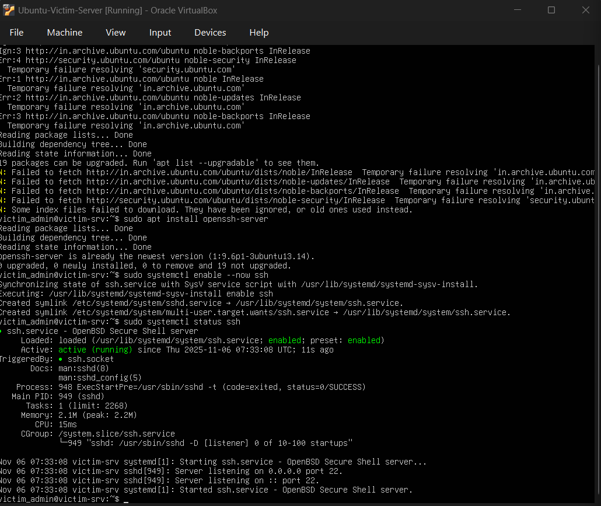
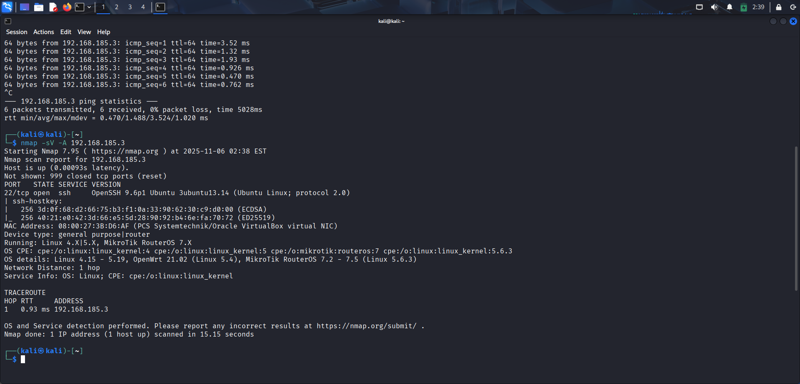
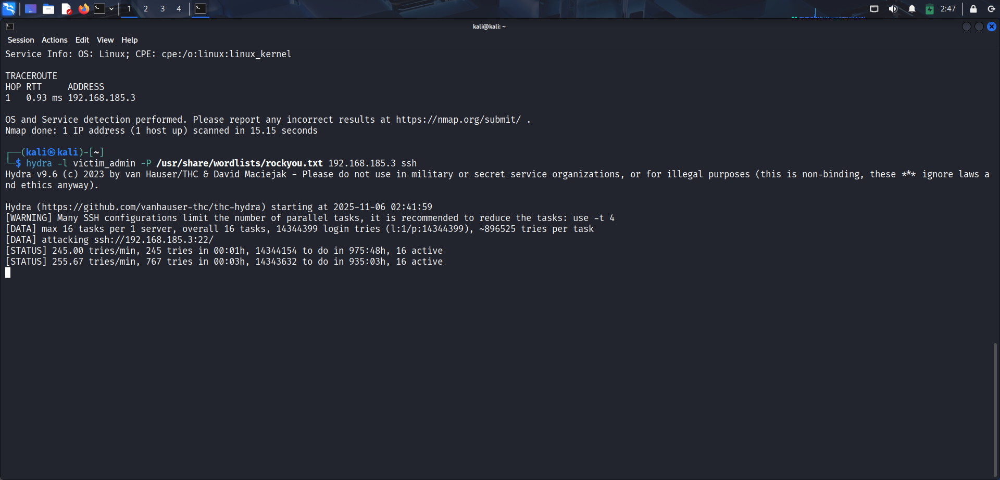

# Linux Mini-SOAR: Automated SSH Brute-Force Detection & Response

This project is a simple, lightweight "Mini-SOAR" (Security Orchestration, Automation, and Response) built entirely in Bash.
It's designed to run on a Linux server (like Ubuntu) to automatically detect high-velocity SSH brute-force attacks and respond by blocking the attacker's IP address at the host firewall.

## 🚀 Features

* **Automated Detection:** Runs on a `cron` schedule to check for threats every minute.
* **Log-Based Hunting:** Parses `journalctl` logs to find evidence of brute-force attacks.
* **Custom Logic:** Uses a configurable threshold (e.g., >20 failed logins in 1 minute) to identify malicious behavior.
* **Automated Response:** Automatically blocks the attacker's IP address using `ufw` (Uncomplicated Firewall).
* **Live Logging:** Outputs all actions to a dedicated log file (`detector.log`) for easy monitoring.

## ⚙️ How It Works

This system works in a simple loop, managed by the root user's `cron`:

1.  **Schedule:** Every 60 seconds, `cron` executes the `bruteforce_detector.sh` script.
2.  **Hunt:** The script queries `journalctl` for all `sshd` logs from the last minute.
3.  **Validate:** It counts the number of "Failed password" or "maximum authentication" attempts from each unique IP address.
4.  **Remediate:** If any IP exceeds the `THRESHOLD` (e.g., 20 attempts), the script uses `ufw` to add a firewall rule, blocking all future connections from that IP.

## 📸 Project Showcase & Evidence

These screenshots document the entire project lifecycle, from setting up the attacker and victim to the final successful, automated detection.

### 1. The Lab: Attacker & Victim Setup

First, I configured two VirtualBox VMs on a host-only network.

* **Victim (Ubuntu Server):** `192.168.185.3`
* **Attacker (Kali Linux):** `192.168.185.4`

(I also had to install `openssh-server` on the minimized Ubuntu victim, as it wasn't included by default.)

### 2. Reconnaissance & Attack

From the Kali VM, I confirmed connectivity with `ping` and used `nmap` to verify that port 22 (SSH) was open. I then launched a high-velocity brute-force attack using `hydra`.

### 3. Manual Hunt: Finding the Threat

By manually inspecting the logs on the Ubuntu server, I could see the `hydra` attack in real-time. This is the log data our script needs to find.

### 4. The "Detection-as-Code" (The Script)

This is the core logic of the detector, written in Bash. It's designed to parse logs and find IPs that cross our `THRESHOLD`.

### 5. Automation: The Root `crontab`

To make this a true "SOAR," I added the script to the system's root `crontab` to run every single minute.

### 6. FINAL RESULT: Automated Detection & Response!

The final screenshot shows the `detector.log` file being updated in real-time. The script successfully:

1.  Detects the attack from `192.168.185.4`.
2.  Logs the "BRUTE-FORCE ATTACK DETECTED!" alert.
3.  Logs the "REMEDIATION: IP 192.168.185.4 blocked." action.

The system works exactly as designed.

